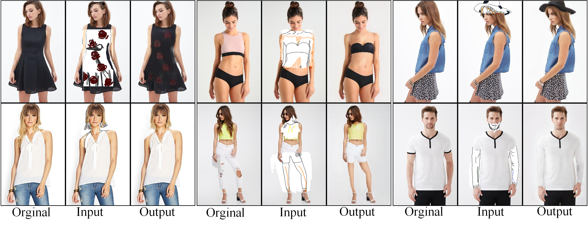
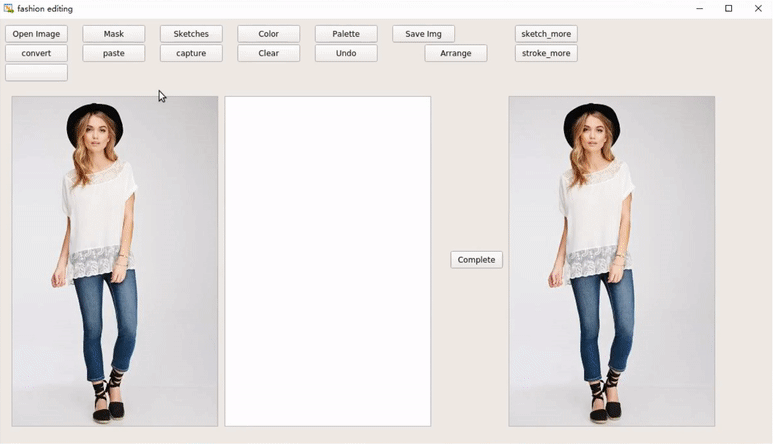
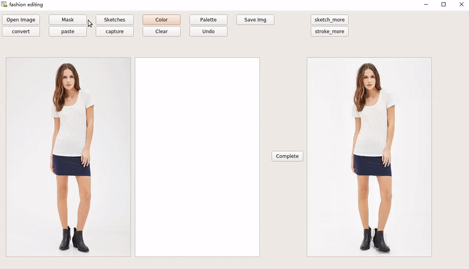

## Fashion Editing with Multi-scale Attention Normalization

### Introduction:
We propose a novel Fashion Editing Generative Adversarial Network (FE-GAN), which is capable of manipulating fashion images by free-form sketches and sparse color strokes. FE-GAN consists of two modules: 1) a free-form parsing network that learns to control the human parsing generation by manipulating sketch and color; 2) a parsing-aware inpainting network that renders detailed textures with semantic guidance from the human parsing map. A new attention normalization layer is further applied at multiple scales in the decoder of the inpainting network to enhance the quality of the synthesized image.



<figure class="half">
    
    
</figure>

## Datasets
- [FashionE  320x512](https://drive.google.com/open?id=1eCestNe4qL5O9yb4q9fJAdVsMEfnBY96)
- [DeepFashion 320x512](https://drive.google.com/open?id=1rv-lsnv-naNo4mVLN_TiTuL1Zz0yS8gr)
- [MPV 320x512](https://drive.google.com/open?id=1-APc9xGalJQLnEzkqb1pCsXXbV83grbe)
- [Irregular Mask](https://drive.google.com/open?id=1gxzo-tGcpCgLhYcGcRpBK1HpyacmrVnt)
- [Color Stroke Mask](https://drive.google.com/open?id=1Qvx3SH904JKt6o9cleLHpEteAP-ymtLf)


## Prerequisites
- Python 3
- PyTorch 1.0
- NVIDIA GPU + CUDA cuDNN


This code requires PyTorch 1.0 and python 3+. Please install dependencies by
```bash
pip install -r requirements.txt
```

### Training 
1. Free-form Parsing Network
```bash
bash scripts/stageI_train.sh 1
```
2. Parsing-aware Inpainting Network
```bash
bash scripts/stageII_matt_train.sh 1
```

### Testing 
1. Free-form Parsing Network
```bash
bash scripts/stageI_test.sh 1
```
2. Parsing-aware Inpainting Network
```bash
bash scripts/stageII_matt_test.sh 1
```

## Code Structure

- `train.py`, `test.py`: the entry point for training and testing.
- `trainers/pix2pix_trainer.py`: harnesses and reports the progress of training.
- `models/pix2pix_model.py`: creates the networks, and compute the losses
- `models/networks/`: defines the architecture of all models
- `options/`: creates option lists using `argparse` package. More individuals are dynamically added in other files as well. Please see the section below.
- `data/`: defines the class for loading images and label maps.
- `stcripts/`: training or testing shell scrpits.

### Tips
More configurations please read the scripts or options.


